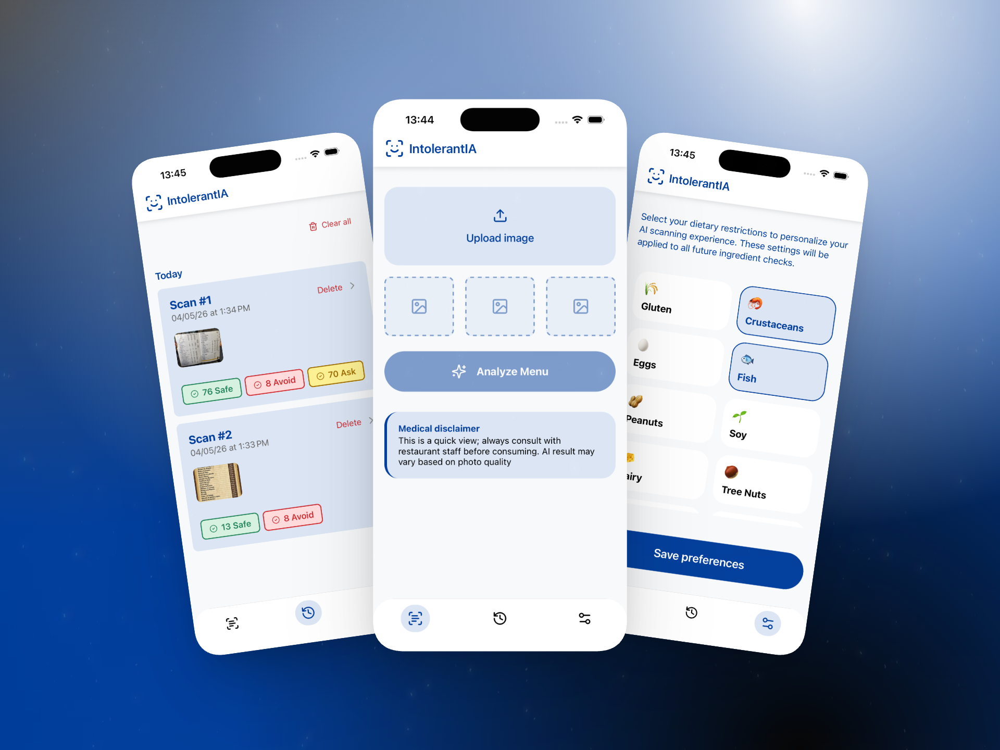

# IntoleranIA

IntolerantIA is an application that uses artificial intelligence to help people with allergies and food intolerances quickly understand what they can eat by analyzing images of menus from bars, restaurants, cafés, and other venues.

<details style="margin-top: 20px;">
  <summary>Table of Contents</summary>

- [🖼️ Screenshots and videos](#️-screenshots)
- [🚀 Getting Started](#-getting-started)
  - [Dependencies](#dependencies)
  - [Installation](#installation)

</details>

## 🖼️ Screenshots and videos

https://github.com/user-attachments/assets/a3490f59-4c75-4a37-bc83-d366e6b39954

<div>
    
</div>

## 🚀 Getting Started

### Environment Variables
To run the project, you need to set up the following environment variables:
```bash
# .env file
AI_GATEWAY_API_KEY=your_fireworks_api_key
```

### Dependencies

> [!IMPORTANT]
> This project requires **Node.js version 24.14.0** or higher.

```bash
# Install pnpm if you don't have it:
npm install -g pnpm
```

### Installation

1. Clone the repository

```bash
git clone https://github.com/alevidals/intolerantia-expo.git
```

2. Install the packages

```bash
pnpm install
```

3. Execute the project

```sh
pnpm run dev
```
